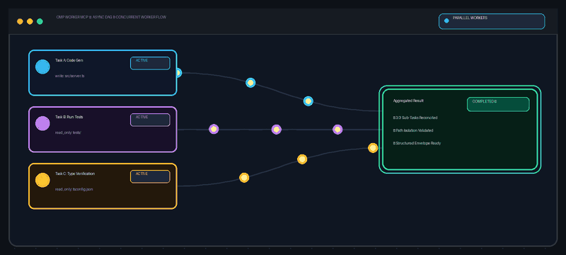

<div align="center">

# omp-worker-mcp

**Durable Model Context Protocol (MCP) server for delegating asynchronous coding tasks and DAG workflows to local Oh My Pi (OMP) CLI sub-agents.**

<p align="center">
  <a href="README.md">English</a> •
  <a href="README.zh-CN.md">简体中文</a>
</p>

[](LICENSE)
[](package.json)
[](https://github.com/divenire990/omp-worker-mcp/actions/workflows/ci.yml)
[](https://modelcontextprotocol.io/)

<br />



<p align="center">
  <em>Asynchronous task execution, DAG dependency resolution, path ownership isolation, and structured result verification.</em>
</p>

[Quick Start](#installation-quick-start) • [Author Experience](#author-workflow-experience) • [MCP Configuration](#mcp-client-configuration) • [Configuration](#configuration-environment-variables) • [State Lifecycle](#state-lifecycle-retention-restart-recovery) • [Available Tools](#available-mcp-tools) • [Safety Contract](#task-safety-ownership-contract) • [Compatibility](#compatibility-changelog) • [Upstream Attribution](#upstream-attribution-support-boundaries)

</div>

---

## Key Highlights

- ⚡ **Asynchronous Delegated Execution**: Offload heavy coding, refactoring, and exploration tasks to background OMP worker instances without blocking your main conversation session.
- 🔀 **Topological DAG Orchestration**: Execute interdependent batch tasks with automatic topological sorting, concurrency control, and dependency propagation.
- 🛡️ **Workspace Path Isolation**: Enforce explicit write-path boundaries and prevent overlapping file modifications between concurrent tasks.
- 🔍 **Supervised Resumption & Envelopes**: Inspect interim logs in real time, extract structured JSON outcome envelopes (`OMP_WORKER_RESULT`), and supply supervisory guidance to retry or adjust tasks.
- 💾 **Persistent State & Configurable Retention**: File-backed state persistence for job metadata and logs with configurable time-to-live (TTL) and disk capacity bounds.

---

## Author Workflow Experience

In the author's daily local workflow, `omp-worker-mcp` is configured with **Gemini 3.7 Flash** as the underlying model for background OMP workers. Within the author's personal Antigravity account and quota environment, where model quotas are relatively generous, this setup has provided a very fast and dependable subjective experience across multi-step coding, research, and batch orchestration workflows.

> **Disclaimer & Boundary Notice**:
> This note reflects the author's personal setup and qualitative workflow experience only. It is **not** an independent benchmark, performance guarantee, or formal service commitment. Model availability, generation speed, quota allocations, and task execution quality vary significantly across different accounts, regions, model versions, task scopes, and local runtime environments. Neither Google Gemini nor Antigravity endorses or sponsors this project.

---

## Upstream Attribution & Support Boundaries

- **External Upstream CLI**: This project interfaces with [Oh My Pi (OMP)](https://github.com/can1357/oh-my-pi), an open-source tool released under the [MIT License](https://github.com/can1357/oh-my-pi/blob/main/LICENSE).
- **Package Scope**: The upstream OMP CLI binary is **not bundled** in this package. Users must install and configure their own local instance of the OMP CLI.
- **Runtime Requirements**:
  - Node.js **>= 22.0.0** (relies on native ECMAScript Modules and standard library capabilities).
  - Users are responsible for complying with the OMP CLI license and terms applicable to their environment.
- **Platform Support**: Windows is fully verified and supported. macOS and Linux are architectural design targets; users should verify local OMP CLI availability and process management behavior.

---

## Features

- **Asynchronous Task Delegation**: Launch background coding workers for long-running workflows while keeping the primary conversational agent responsive.
- **DAG & Batch Orchestration**: Run interdependent batch tasks with automatic dependency resolution, concurrency limiting, and failure containment.
- **Strict Task Safety & Ownership**: Built-in validation checks prevent parallel tasks from declaring overlapping write paths within the same workspace.
- **Continuous Supervision & Feedback**: Stream logs, inspect structured verification details, and inject guidance into failed or blocked jobs.
- **Conservative State Storage**: Safely persists job metadata, prompts, and output logs to disk with optional configurable cleanup policies.

---

## Installation & Quick Start

### Running via npx or global npm install

You can run `omp-worker-mcp` directly without cloning the repository:

```bash
# Run directly via npx
npx omp-worker-mcp

# Or install globally
npm install -g omp-worker-mcp
omp-worker-mcp --help
```

### Building from Source

```bash
# 1. Clone the repository
git clone https://github.com/divenire990/omp-worker-mcp.git
cd omp-worker-mcp

# 2. Install dependencies
npm ci

# 3. Build TypeScript to dist/
npm run build

# 4. Run test suite
npm test
```

---

## MCP Client Configuration

`omp-worker-mcp` communicates over standard I/O (stdio). Below are configuration examples for various MCP clients.

### Codex Configuration (`config.toml`)

#### Using npx (Recommended)
```toml
[mcp_servers.omp-worker]
command = "npx"
args = ["-y", "omp-worker-mcp"]

[mcp_servers.omp-worker.env]
OMP_WORKER_OMP_COMMAND = "omp"
```

#### Using Local Source Build
```toml
[mcp_servers.omp-worker]
command = "node"
args = ["/path/to/omp-worker-mcp/dist/index.js"]

[mcp_servers.omp-worker.env]
OMP_WORKER_OMP_COMMAND = "omp"
```

### Claude Desktop Configuration (`claude_desktop_config.json`)

```json
{
  "mcpServers": {
    "omp-worker": {
      "command": "npx",
      "args": ["-y", "omp-worker-mcp"],
      "env": {
        "OMP_WORKER_OMP_COMMAND": "omp"
      }
    }
  }
}
```

---

## Configuration & Environment Variables

All settings can be configured via environment variables in your system or within the MCP client configuration.

| Variable | Description | Default |
| :--- | :--- | :--- |
| `OMP_WORKER_OMP_COMMAND` | Path or executable name for the OMP CLI binary. | `omp` |
| `OMP_WORKER_OMP_PREFIX_ARGS` | JSON array string of arguments prepended to OMP CLI invocations (e.g. `["--profile", "default"]`). | `[]` |
| `OMP_WORKER_STATE_DIR` | Base directory for storing job states, prompt files, and execution logs. | `~/.codex/state/omp-worker` |
| `OMP_WORKER_BROWSER_RULES` | Optional custom browser automation instructions injected into worker prompts. | *(none)* |
| `OMP_WORKER_RETENTION_TTL_SECONDS` | Optional retention TTL in seconds for terminal job/group records. Unset disables TTL cleanup. | *(none)* |
| `OMP_WORKER_RETENTION_MAX_BYTES` | Optional maximum disk storage in bytes for terminal records. Unset disables size cleanup. | *(none)* |
| `OMP_WORKER_AUTO_CLEANUP_ON_START` | Optional boolean (`"true"` / `"1"`) to trigger a cleanup sweep once when MCP server starts. | `false` |

---

## State Lifecycle, Retention & Restart Recovery

### On-Disk Directory Layout

All state records are stored under `OMP_WORKER_STATE_DIR` (defaults to `~/.codex/state/omp-worker`):
```text
~/.codex/state/omp-worker/
├── jobs/
│   └── job-<timestamp>-<hash>/
│       ├── job.json              # Job metadata, parameters, and status
│       ├── cancel.request.json   # Cancellation signal (if requested)
│       ├── attempt-01.prompt.md  # Generated prompt for attempt 1
│       ├── stdout.log            # Execution standard output
│       └── stderr.log            # Execution standard error
└── groups/
    └── group-<timestamp>-<hash>/
        ├── group.json            # Batch DAG metadata, tasks, and status
        └── cancel.request.json   # Group cancellation signal (if requested)
```

### Retention and Cleanup Policies

- **Conservative by Default**: By default, `omp-worker-mcp` **never automatically deletes completed or historical records**, preventing unexpected data loss.
- **Explicit Cleanup Rules**: Users can opt in to automatic retention by setting `OMP_WORKER_RETENTION_TTL_SECONDS` (pruning terminal records older than N seconds) or `OMP_WORKER_RETENTION_MAX_BYTES` (pruning oldest terminal records when total disk usage exceeds threshold).
- **Protection for Active Jobs**: Non-terminal records (`dispatched`, `running`, `pending`, `validating`, `cancelling`) are **strictly protected and never pruned**.
- **Corrupted Record Protection**: Any record that cannot be verified as terminal is preserved to prevent accidental deletion. Symbolic links within state directories are rejected and never traversed.
- **Transparent Diagnostics**: Cleanup failures or permission issues are surfaced in structured error logs rather than silently ignored.

### Server Restart & Crash Recovery

- **Metadata Persistence**: Job and DAG group metadata are written atomically to disk. Dispatched and completed task records remain fully accessible across server restarts via `omp_result` and `omp_wait`.
- **Process Decoupling**: If the MCP server restarts while an external worker process is executing, the server does not attempt unmanaged re-attachment to orphaned processes; the persisted state and captured logs accurately reflect the recorded state.

---

## Available MCP Tools

### Single Task Delegation Tools

| Tool | Purpose |
| :--- | :--- |
| `omp_run_compact` | **Recommended for single tasks**: Delegates a coding task and waits up to `wait_seconds` for completion in one turn, returning a compact summary. |
| `omp_delegate` | Low-level dispatch: Spawns an asynchronous background worker and immediately returns a `job_id`. |
| `omp_wait` | Waits for a running background job to finish or poll until a timeout is reached. |
| `omp_result` | Inspects full attempt history, execution logs, generated artifacts, and parsed structured outcome envelopes. |
| `omp_continue` | Injects supervisory guidance/correction into a failed or blocked task to trigger a new attempt within the same session. |
| `omp_cancel` | Gracefully terminates a running task and its spawned child process tree. |

### Batch & DAG Orchestration Tools

| Tool | Purpose |
| :--- | :--- |
| `omp_run_batch_compact` | **Recommended for multi-task workflows**: Spawns an interdependent batch task graph (DAG) with concurrency limits and waits for aggregated completion. |
| `omp_wait_group` | Waits for an asynchronous batch task group to make progress or complete. |
| `omp_cancel_group` | Cancels all active and queued tasks within a batch task group. |

---

## Task Safety & Ownership Contract

1. **Write vs. Read-Only Boundaries**:
   - `write` tasks must explicitly declare the file paths they own via `ownership_paths`.
   - `read_only` tasks are prohibited from performing workspace modifications.
2. **DAG Overlap Verification**:
   - Parallel tasks within the same batch cannot declare overlapping write boundaries.
   - Tasks operating on shared paths must declare explicit linear dependencies (`depends_on`).
3. **Structured Verification Contract**:
   - Subagents deliver final results using the structured `OMP_WORKER_RESULT` format, returning status, summary, modified artifacts, verification checks, and remaining items.

---

## Compatibility & Changelog

- **Upgrade & Versioning Policies**: Review [COMPATIBILITY.md](./COMPATIBILITY.md) for public contract definitions, deprecation policies, and upgrade guarantees.
- **Release History**: Review [CHANGELOG.md](./CHANGELOG.md) for notable changes across releases.

---

## License

This project is licensed under the [MIT License](LICENSE).
