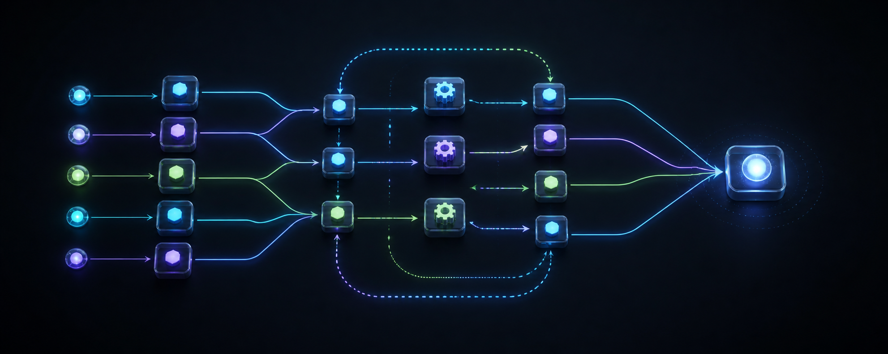

<div align="center">

# omp-worker-mcp

**Durable Model Context Protocol (MCP) server for delegating asynchronous coding tasks and DAG workflows to local Oh My Pi (OMP) CLI sub-agents.**

[](LICENSE)
[](package.json)
[](https://modelcontextprotocol.io/)

<br />



<br /><br />


<p align="center">
  <em>Asynchronous task execution, DAG dependency resolution, path ownership isolation, and structured result verification.</em>
</p>

[Quick Start](#installation--quick-start) • [Configuration](#configuration) • [Available Tools](#available-mcp-tools) • [Safety Contract](#task-safety--ownership-contract) • [Upstream Attribution](#upstream-attribution--disclaimer)

</div>

---

## Key Highlights

- ⚡ **Asynchronous Delegated Execution**: Offload heavy coding, refactoring, and exploration tasks to background OMP worker instances without blocking your main conversation session.
- 🔀 **Topological DAG Orchestration**: Execute interdependent batch tasks with automatic topological sorting, concurrency control, and dependency propagation.
- 🛡️ **Workspace Path Isolation**: Enforce explicit write-path boundaries and prevent overlapping file modifications between concurrent tasks.
- 🔍 **Supervised Resumption & Envelopes**: Inspect interim logs in real time, extract structured JSON outcome envelopes, and supply supervisory guidance to retry or adjust tasks.

---

## Upstream Attribution & Disclaimer

- **External Upstream CLI**: This project interfaces with [Oh My Pi (OMP)](https://github.com/can1357/oh-my-pi), an open-source tool released under the [MIT License](https://github.com/can1357/oh-my-pi/blob/main/LICENSE).
- **Non-Official Project**: `omp-worker-mcp` is an independent, community-developed MCP server. It is **not** an official Oh My Pi project and is not affiliated with or endorsed by the upstream OMP maintainers.
- **No Bundling / No Distribution**: This project **does not bundle, package, link, or distribute the OMP CLI binary or its source code**. It solely executes the user's locally installed, external OMP CLI binary via process invocation (`OMP_WORKER_OMP_COMMAND`).
- **User Prerequisites**:
  - Node.js **>= 22.0.0**.
  - Users must install and configure their own local instance of the OMP CLI.
  - Users are responsible for complying with the OMP CLI license and terms applicable to their environment.

---

## Features

- **Asynchronous Delegated Execution**: Launch independent sub-agent coding tasks without blocking the main conversational session.
- **DAG & Batch Orchestration**: Run interdependent batch tasks with topological dependency sorting, concurrency limits, and automatic dependency propagation.
- **Strict Task Safety & Ownership**: Built-in validation checks prevent multiple concurrent tasks from writing to overlapping file paths or colliding within the same workspace.
- **Continuous Supervision & Feedback**: Inspect interim output, stream logs, retrieve structured JSON envelopes, and supply supervisory feedback to continue or retry attempts.
- **Cross-Platform Design**: Designed for local Node.js environments on Windows, macOS, and Linux; validate OMP CLI availability on your platform.

---

## Installation & Quick Start

```bash
# 1. Clone the repository
git clone https://github.com/divenire990/omp-worker-mcp.git
cd omp-worker-mcp

# 2. Install dependencies
npm ci

# 3. Build TypeScript to dist/
npm run build

# 4. Run test suite
npm test
```

---

## Configuration

Configuration is managed via environment variables (or configured directly in your MCP client).

| Variable | Description | Default |
| :--- | :--- | :--- |
| `OMP_WORKER_OMP_COMMAND` | Path or executable name for the OMP CLI binary. | `omp` |
| `OMP_WORKER_OMP_PREFIX_ARGS` | JSON array of arguments prepended to OMP CLI invocations. | `[]` |
| `OMP_WORKER_STATE_DIR` | Directory for storing job states, attempts, logs, and artifacts. | `~/.codex/state/omp-worker` |
| `OMP_WORKER_BROWSER_RULES` | Optional custom browser automation instructions injected into task prompts. | *(none)* |

### Cross-Platform Environment Examples

#### Windows (cmd / PowerShell)
```cmd
set OMP_WORKER_OMP_COMMAND=omp
set OMP_WORKER_STATE_DIR=C:\Users\YourUser\.codex\state\omp-worker
```

#### macOS / Linux (bash / zsh)
```bash
export OMP_WORKER_OMP_COMMAND=/usr/local/bin/omp
export OMP_WORKER_STATE_DIR=/home/youruser/.codex/state/omp-worker
```

---

## Codex MCP Client Configuration Example

Add the server to your Codex MCP configuration (e.g. in `config.toml`):

### Windows Example
```toml
[mcp_servers.omp-worker]
command = "node"
args = ["C:/path/to/omp-worker-mcp/dist/index.js"]

[mcp_servers.omp-worker.env]
OMP_WORKER_OMP_COMMAND = "omp"
OMP_WORKER_STATE_DIR = "C:/Users/YourUser/.codex/state/omp-worker"
```

### macOS / Linux Example
```toml
[mcp_servers.omp-worker]
command = "node"
args = ["/path/to/omp-worker-mcp/dist/index.js"]

[mcp_servers.omp-worker.env]
OMP_WORKER_OMP_COMMAND = "/usr/local/bin/omp"
OMP_WORKER_STATE_DIR = "/home/youruser/.codex/state/omp-worker"
```

---

## Available MCP Tools

| Tool | Purpose |
| :--- | :--- |
| `omp_run_compact` | Convenience tool: delegates a single task and waits up to `wait_seconds` for completion in one turn. |
| `omp_delegate` | Spawns an asynchronous background worker for a coding task and immediately returns a `job_id`. |
| `omp_wait` | Waits for a running background job to finish or poll until a timeout is reached. |
| `omp_result` | Fetches full attempt history, logs, outputs, and parsed structured envelopes for a job. |
| `omp_continue` | Feeds supervisory correction/guidance into a failed or blocked job for a new attempt. |
| `omp_cancel` | Gracefully terminates a running job and its child process tree. |
| `omp_run_batch_compact` | Spawns a dependency graph (DAG) of parallel/sequential batch tasks and waits for completion. |
| `omp_wait_group` | Waits for an asynchronous batch task group to progress or complete. |
| `omp_cancel_group` | Cancels all running and queued tasks within a batch group. |

---

## Task Safety & Ownership Contract

1. **Write vs. Read-Only Isolation**:
   - `write` tasks must declare the specific file paths they own.
   - `read_only` tasks are strictly restricted from workspace modification.
2. **DAG Overlap Verification**:
   - Tasks running in parallel cannot declare overlapping write boundaries.
   - Tasks modifying shared paths must declare explicit linear DAG dependencies (`depends_on`).
3. **Structured Verification Contract**:
   - Every completed sub-task is expected to return structured verification details and updated artifact descriptions.

---

## License

This project is licensed under the [MIT License](LICENSE).
