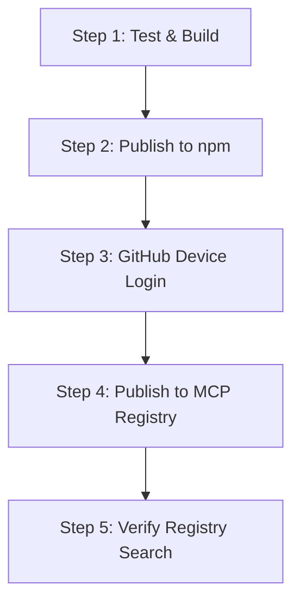

<div align="center">

# Official MCP Registry Publishing Guide

**Step-by-step workflow for publishing `omp-worker-mcp` to npm and the Official Model Context Protocol Registry.**

<p align="center">
  English •
  <a href="registry-publishing.zh-CN.md">简体中文</a> •
  <a href="README.md">Documentation Index</a>
</p>

</div>

---

## 1. Overview & Requirements

Publishing `omp-worker-mcp` as an official Model Context Protocol server requires registering package metadata with both **npm** (the runtime distribution registry) and the **Official MCP Registry** (the discovery and verification registry).

### Key Metadata Files

- **`package.json`**:
  - `version`: The semantic release version to be published (read or bump as appropriate).
  - `mcpName`: `io.github.divenire990/omp-worker-mcp` (Required for official registry namespace verification).
  - `files`: Includes `dist`, `bin`, `server.json`, `README.md`, `LICENSE`.
- **`server.json`**:
  - Conforms to schema `https://static.modelcontextprotocol.io/schemas/2025-12-11/server.schema.json`.
  - Declares stdio transport, `npx -y omp-worker-mcp` runtime execution, and `OMP_WORKER_OMP_COMMAND` environment configuration.

---

## 2. Release & Publishing Order

Follow this exact sequence when executing a new release:



### Step 1: Test & Local Build Verification

Run the full automated test suite and check the package tarball contents:

```bash
# Execute TypeScript build and Node.js test suite
npm run test

# Verify package contents without creating a tarball
npm pack --dry-run
```

Ensure all tests pass and that `server.json` is listed in the package tarball output.

### Step 2: Publish to npm

Publish the package with public access:

```bash
npm publish --access public
```

> **Note**: Verify that the targeted release version in `package.json` is live and accessible on [npmjs.com/package/omp-worker-mcp](https://www.npmjs.com/package/omp-worker-mcp) before proceeding to registry publishing.

### Step 3: Authenticate with MCP Publisher CLI

Log in to the MCP Registry using GitHub authentication:

```bash
npx @modelcontextprotocol/publisher login github
```

> **Important**: This step initiates a GitHub OAuth device authorization flow. It **requires the repository owner's interactive browser interaction** to approve the one-time device code. Automated or non-interactive environments must pause here for owner consent.

### Step 4: Publish to the Official MCP Registry

Publish the server manifest:

```bash
npx @modelcontextprotocol/publisher publish
```

The publisher tool will:
1. Validate `server.json` against the official schema.
2. Verify GitHub repository ownership against the authenticated account (`divenire990`).
3. Check the published npm package for the matching `mcpName` (`io.github.divenire990/omp-worker-mcp`).
4. Register the server in the official catalog.

### Step 5: Verify Registry Availability

Confirm the published server is searchable and metadata matches:

```bash
# Query the registry catalog or use the MCP Inspector
npx @modelcontextprotocol/inspector npx -y omp-worker-mcp
```

---

## 3. Benchmark & Telemetry Protocol

When performing benchmarks or cross-platform evaluations with `omp-worker-mcp`:

1. **Grounded Task Tracking**: Record worker job IDs, timestamp intervals (`start_time`, `finish_time`), and structured `OMP_WORKER_RESULT` payloads from the state directory (`~/.codex/state/omp-worker/jobs/`).
2. **Harness Telemetry Boundaries**: The worker captures child CLI exit codes and output streams. Do not synthesize or infer primary-harness token costs or comparative benchmark claims unless explicit telemetry data is captured from the underlying engine.
3. **Reproducibility**: Document the exact OMP model profile, OS environment, and input prompt files for all benchmark runs.

---

## 4. Release Constraints & Safety Policies

- **Preparation Boundary**: Preparing release metadata (updating `package.json`, `server.json`, `CHANGELOG.md`, and documentation) does not execute npm publish, git commits, or remote pushes.
- **No Secrets**: Never include API keys, internal paths, or unverified capability flags in `server.json`.
