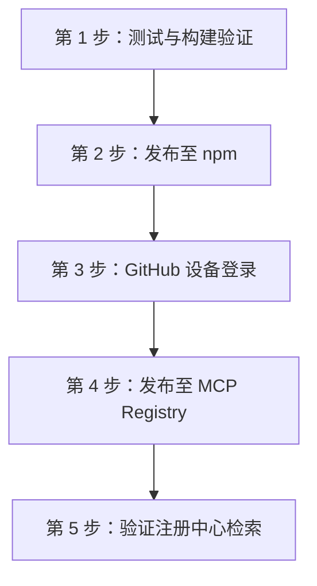

<div align="center">

# 官方 MCP Registry 发布指南

**`omp-worker-mcp` 发布至 npm 与官方 Model Context Protocol Registry 的完整操作流程。**

<p align="center">
  <a href="registry-publishing.md">English</a> •
  简体中文 •
  <a href="README.zh-CN.md">文档索引</a>
</p>

</div>

---

## 1. 概述与准备要求

将 `omp-worker-mcp` 注册为官方 Model Context Protocol 服务需要向两个注册中心同步元数据：**npm**（运行时分发仓库）与 **Official MCP Registry**（官方发现与验证注册表）。

### 核心元数据文件

- **`package.json`**：
  - `version`：待发布的语义化版本号（请核验或升级 `package.json` 中的版本）。
  - `mcpName`：`io.github.divenire990/omp-worker-mcp`（官方注册中心反向 DNS 命名空间校验字段）。
  - `files`：包含 `dist`、`bin`、`server.json`、`README.md`、`LICENSE`。
- **`server.json`**：
  - 符合官方规范 `https://static.modelcontextprotocol.io/schemas/2025-12-11/server.schema.json`。
  - 声明 stdio 传输通道、`npx -y omp-worker-mcp` 运行时启动参数以及必需的环境变量 `OMP_WORKER_OMP_COMMAND`。

---

## 2. 正式发布执行顺序

发布新版本时，必须严格按照以下顺序执行：



### 第 1 步：测试与本地构建验证

运行完整自动化测试套件并检查打包清单：

```bash
# 执行 TypeScript 构建与测试套件
npm run test

# 检查打包文件清单（干跑，不产生实际压缩包）
npm pack --dry-run
```

确认所有单元与集成测试全部通过，且 `server.json` 包含在发布打包清单中。

### 第 2 步：发布至 npm

以公开包权限发布到 npm：

```bash
npm publish --access public
```

> **注意**：在继续发布到 MCP Registry 前，请在 [npmjs.com/package/omp-worker-mcp](https://www.npmjs.com/package/omp-worker-mcp) 确认 `package.json` 中声明的待发布版本已成功上线且元数据生效。

### 第 3 步：通过 MCP Publisher CLI 登录认证

使用 GitHub 账号登录官方 MCP 发布工具：

```bash
npx @modelcontextprotocol/publisher login github
```

> **重要说明**：该命令将启动 GitHub OAuth 设备授权流程（Device Flow）。**必须由仓库所有者（Repository Owner）在浏览器中手动输入授权码并确认许可**。自动化脚本或非交互会话需在此步骤等待所有者操作完成。

### 第 4 步：发布至官方 MCP Registry

提交并发布服务清单：

```bash
npx @modelcontextprotocol/publisher publish
```

发布工具将自动执行以下检查：
1. 校验 `server.json` 是否符合官方 JSON Schema。
2. 验证已登录的 GitHub 账号与仓库所有权（`divenire990`）。
3. 检查 npm 已发布包中的 `package.json` 是否包含匹配的 `mcpName`（`io.github.divenire990/omp-worker-mcp`）。
4. 将服务元数据登记至官方 MCP 服务目录。

### 第 5 步：验证注册中心可检索性

确认服务在注册中心已收录且元数据准确：

```bash
# 使用 MCP Inspector 或 CLI 校验运行状态
npx @modelcontextprotocol/inspector npx -y omp-worker-mcp
```

---

## 3. 基准测试与评估协议

在进行多平台对比或基准测试（Benchmark）时，遵循以下规范：

1. **客观数据记录**：记录任务分发时间戳、执行耗时、提示词长度以及状态目录（`~/.codex/state/omp-worker/jobs/`）中持久化的 `OMP_WORKER_RESULT` 结构体。
2. **遥测边界清晰**：Worker 准确记录子进程退出码与标准输出流。严禁在缺乏主框架真实遥测数据的情况下伪造对比成本或 Token 数据。
3. **环境可复现性**：完整记录测试使用的 OMP 模型 Profile、操作系统版本与测试提示词。

---

## 4. 安全规范与版本准备边界

- **准备阶段限制**：版本准备仅更新元数据（`package.json`、`server.json`、`CHANGELOG.md` 及文档），严禁在此阶段执行 npm 发布、git commit 或 git push。
- **无敏感信息**：`server.json` 严禁包含 API Key、密钥、本地专属绝对路径或虚假声明的能力。
